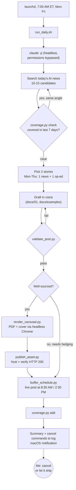

# LinkedIn content agent


An autonomous agent that writes and schedules my LinkedIn posts. Every weekday
morning a scheduler starts Claude Code headless. It finds two AI news stories I
haven't covered, drafts posts in my voice, checks them against hard rules
enforced in code, renders some as PDF carousels, and schedules them in Buffer.
Each post sits in a cancel window before it goes live, and the voice rules are
built from the edits I make to its drafts.

About 1,000 lines of Python and shell, plus about 1,100 lines of instruction
docs that the agent reads on every run. [`CLAUDE.md`](CLAUDE.md) is the agent's
operating manual.

> **Public portfolio copy.** Credentials, account IDs, hosting URLs, logs and
> most of the post history have been removed. The story bank and op-ed themes
> are fictional placeholders, and the carousel design system is a neutral one
> written for this copy. Everything else is the code and instructions that run
> in production.

## The daily flow



## Ideas worth looking at

**Rules enforced in code, not just in the prompt.** A rule that lives only in a
prompt drifts as the model writes around it. A rule in a script doesn't.
[`validate_post.py`](validate_post.py) blocks scheduling unless a post has
exactly five hashtags with no two from the same family (`#AI` and
`#ArtificialIntelligence` count as one), no em or en dashes, no banned words, no
closing question, at least one number, and a length inside the range I actually
publish. [`render_carousel.py`](render_carousel.py) refuses any carousel that
isn't 4 or 6 frames or has more than 18 words on a frame.
[`buffer_schedule.py`](buffer_schedule.py) runs the validator itself and refuses
to schedule a failing post. The two earliest posts in [`posts/`](posts/) fail
today's validator; they shipped before those rules existed.

**A human in the loop by default, through a cancel window.** Posts are created as
live scheduled posts, not drafts. The scheduler won't book a slot less than 15
minutes out, so there's always time to kill a post with one copy-pasted
command (`buffer_schedule.py --cancel <id>`), which the run prints for each
post. If I do nothing, the post ships. That was deliberate: approving every
post was the bottleneck I was trying to remove. There's one exception. If the
laptop was asleep and the 8:30 slot has passed, the morning post goes out
immediately with no window (`--now-if-past`). The afternoon post is skipped
instead.

**Learning from edits.** When I rewrite a draft, the machine version and my
version go into [`docs/examples/`](docs/examples/) with the rule each change
implies, and the agent reads them before every draft. The rules that keep
coming back get promoted into code. The "interpretive nudge" phrases I kept
deleting became a warning list in the validator. "No closing question" started
as advice, got a carve-out, and became a hard failure once I said it was cheesy.

**Deduplication.** [`coverage.py`](coverage.py) keeps a record of every
published story, with its subjects and angle. The run checks candidates against
it before drafting. A repeat story is allowed only on a new angle, which the run
has to name.

**Trust nothing that wasn't read back.** After deploying, `publish_asset.py`
won't report a carousel URL as live until it returns HTTP 200. `buffer_schedule.py` exits with an
error unless Buffer reports `scheduled`. `buffer_status.py` exists because
editing a draft in Buffer's own composer once flipped it to live.

## Autonomy: what it can do unattended

The daily run calls `claude -p ... --permission-mode bypassPermissions`. That
means the agent runs any shell command, edits any file and makes any network
call without asking. Nobody is watching when it runs. The safeguards are:

- the scripts above, which refuse bad posts and unverified assets
- the cancel window on every scheduled post
- a full log of each run in `logs/`

These are guardrails, not a sandbox. The rule against using
`--skip-validation` is enforced only by the prompt, and nothing technically
stops the agent from calling the Buffer API directly. Running it this way is a
trust decision I made for a low-stakes channel. I wouldn't make it for anything
that moves money or touches other people's data.

## Stack

- **Claude Code CLI**, run headless (`claude -p`), with a fallback model
- **Python 3.9+**, standard library only (`urllib`, `zoneinfo`, `json`)
- **zsh + launchd** for the weekday schedule (cron works too)
- **Buffer GraphQL API** for scheduling, cancelling and status
- **Headless Google Chrome** turns HTML/CSS into the carousel PDF and cover image
- **Netlify CLI** hosts the carousel PDFs at public URLs
- Fonts: Playfair Display and Inter (Google Fonts, SIL OFL)

## Layout

```
CLAUDE.md                 agent operating manual (loaded automatically)
run_daily.sh              entry point the scheduler fires
validate_post.py          hard gates for a post
coverage.py               record of covered stories, used for dedupe
render_carousel.py        JSON spec -> 1200x1500 PDF + cover PNG
publish_asset.py          host a carousel and confirm it is live
buffer_schedule.py        schedule / cancel a live post
buffer_draft.py           create a draft only (manual use)
buffer_status.py          read back true post status
docs/01-05                voice, design system, story bank, worker spec, daily procedure
docs/06-oped-themes.md    the only allowed source of opinions
docs/examples/            machine draft vs. my rewrite, with the rules they produce
posts/  carousels/        a sample of 10 published posts and their carousel specs
drafts/oped/queue/        approved op-eds waiting for a slot
```

## Tests

- `pip install -r requirements-dev.txt`, then `pytest` from the repo root.
- Covers every gate in `validate_post.py` (pass and fail), duplicate-story detection in `coverage.py`, the Eastern-time and cancel-window rules in `buffer_schedule.py`, and the Buffer GraphQL requests themselves.
- Also checks carousel spec limits, content-hashed hosting, and that the sample posts and carousels in this repo still match what the README says about them.
- No network, no credentials and no Chrome: HTTP, `netlify`, `curl` and Chrome are all replaced with fakes.
- Runs on every push and pull request via GitHub Actions.

## Setup

```bash
cp .env.example .env            # fill in the Buffer token and IDs, and hosting settings
python3 validate_post.py posts/*.md
python3 render_carousel.py carousels/etched.json         # -> build/etched.pdf
python3 buffer_schedule.py posts/2026-08-19-etched.md --at 2026-12-01T08:30 --dry-run
```

To run it on a schedule, point a launchd agent (or cron) at `run_daily.sh` for
7:00 AM Monday to Friday. The script needs `claude` on its `PATH` and a
logged-in Claude Code session. Configuration is in [`.env.example`](.env.example).
